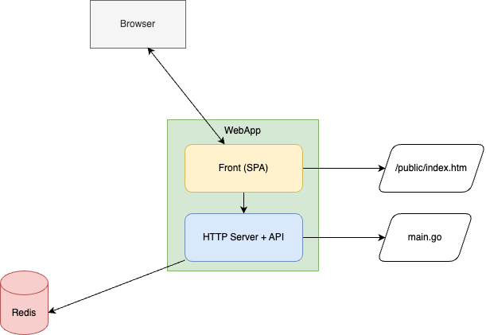

# My application: Restaurants in Paris

This is a simple Go application that retrieves data (some good restaurants in Paris) from a Redis database and displays it in a web page.

## GoLang Application

<!--

-->

## API (👀 at `main.go`)

- `/api/info` retrieves the content of the `info.txt` file
- `/api/variables` retrieves the value of 2 environment variables (`MESSAGE` and `TITLE`) and the value of `appName` (`appName` is a random string)
- `/api/restaurants` retrieves the list of restaurants from the Redis database

## What are we going to do during this demonstration?

- Dockerize the application
- Use Docker Compose to run and develop the application
- Improve the image size and remove the vulnerabilities
- Use a multi-stage build
- Use Docker Debug
- Run some tests with Testcontainers
- A quick glance at Docker Bake
- Deploy the application on Kubernetes (the K8S of Docker Desktop)
___
[Next: I need to dockerize my application ▶️](./01-dockerize.md)